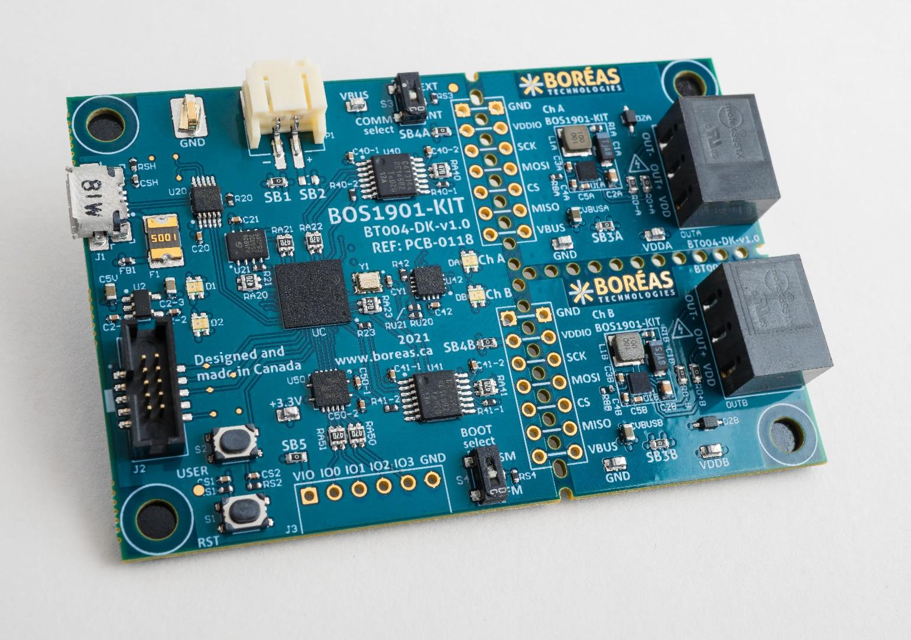
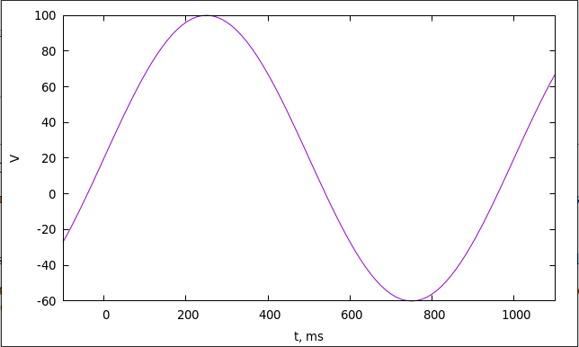

Objective
=========

It is desirable to build a driver controller for 4 piezo actuators with
sine-like waveforms controls of the same frequency (range to be
determined) and π/2 phase shifts between 4 signals.

  Actuator   Phase shift
  ---------- -------------
  1          0
  2          π/2
  3          π
  4          3π/2

Considerations
==============

Hardware
--------

BOS1901-KIT
[[https://www.boreas.ca/products/bos1901-development-kit]{.underline}](https://www.boreas.ca/products/bos1901-development-kit)
is a toolkit comprising a STM32F413VGH6 based development board and two
BOS1901 based piezo actuator driver modules in a perforated break-away
design.

{width="6.925in" height="4.861805555555556in"}

Firmware supplied by the manufacturer allows control of two actuators
over two SPI interfaces, one per module.

Although STM32F413 MCU has 5 SPI interfaces, only two of them are routed
on this board. In addition, 4 GPIO signals are present on J3 header (not
populated, but routed) -- on the photo it's in the bottom part of MCU
board, marked IO0, IO1, IO2 and IO3. This will allow synchronization
with another instance of the same board that obviously will be required
to drive 4 actuators. This will require firmware modification which can
be done as all software is supplied in source code form under permissive
licenses, like BSD 3-Clause and similar.

There are multiple possible designs to achieve synchronization of four
actuator signals. All of them will need 4 actuator driver modules,
possibly broken away from MCU part of the board. To name several
decisions, we can think of:

-   Two BOS1901-KIT sets synchronized using IOx pins

-   One BOS1901-KIT ser with two extra BOS1901 actuator modules using
    > IOx pins as CS signals to multiplex SPI interfaces

-   Four BOS1901 actuator drivers broken away from their MCU boards and
    > used with third-party development board. This can allow using
    > software other than STM32Cube based supplied by manufacturer. For
    > example, Raspberry Pi or BeagleBoard can run Linux. All that's
    > required of the board is the presence of 4 SPI interfaces

Waveforms
---------

Waveforms are required to:

1.  Be T~p~/4 apart from each other where T~p~ is the period length

2.  Have a "tilt" where positive half period of the cycle is somewhat
    stronger than the negative one. This can be achieved by applying
    some positive bias ΔV. So, if V~max~ is the max positive output
    voltage, it can be described as\
    \
    $\left( V_{\max} - \Delta V \right) \cdot \sin\frac{2\pi \cdot t}{T_{0}} + \Delta V$\
    \
    {width="6.675in" height="4.3590277777777775in"}

    Detailed waveforms parameters will be determined experimentally.
